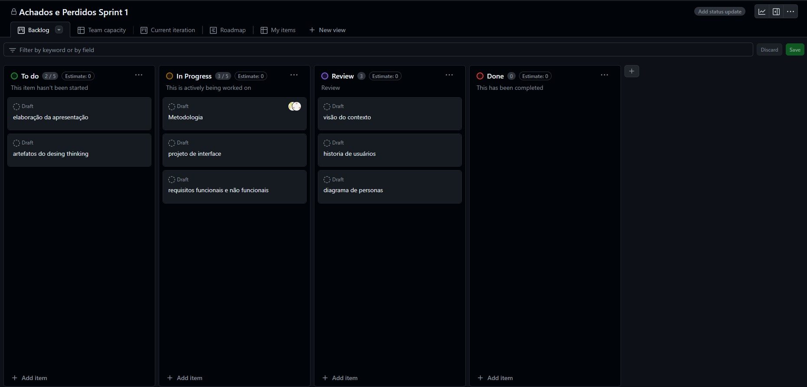

# Documentação do Projeto (TIDocs)

Esta pasta armazena a documentação do projeto para a disciplina de **Trabalho Interdisciplinar 1** dos cursos de Tecnologia da Informação da **[PUC Minas](https://pucminas.br)**. Essa documentação é estruturada na forma de um site que fica disponível por meio do GitHub Pages e pode ser incluído, também, no site da solução hospedada. Um [exemplo publicado do TIDocs](https://webtech-puc-minas.github.io/ti1-template/) está disponível por meio do repositório do **[WebTech PUC Minas](https://github.com/webtech-pucminas)**.

A documentação do projeto inclui as seguintes seções:

1. Introdução
2. Contexto
3. Concepção
4. Metodologia
5. Solução
6. FAQ (Questões frequentes)
7. Referências Bibliográficas

O template para o site é estruturado e permite que a equipe evolua a documentação do projeto à medida que avance no desenvolvimento.

# Orientações gerais

Esta seção traz explicações breves sobre o conjunto de artefatos que precisam ser incluídos na documentação do projeto com uma conjunto de links importantes para que se entenda como criar cada coisa. 

## Problema

Atualmente, muitas instituições e locais públicos possuem sistemas de achados e perdidos que são fragmentados, pouco eficientes e não interconectados. Isso resulta em uma baixa taxa de recuperação de objetos perdidos e em frustração para os usuários que perdem tempo tentando localizar seus pertences sem sucesso. Além disso, a falta de um sistema padronizado e acessível aumenta as chances de itens acabarem esquecidos ou descartados, gerando desperdício e perda.

## Objetivos

O objetivo geral deste projeto é desenvolver um sistema web de achados e perdidos que ofereça uma interface amigável e centralize informações de itens perdidos e encontrados, facilitando a comunicação e a devolução eficiente dos objetos aos seus respectivos donos em uma comunidade específica, como um campus universitário, uma empresa ou um evento.
1.	Facilitar Registro e Gerenciamento de Itens: Criar funcionalidades intuitivas para que os usuários possam registrar e gerenciar itens perdidos ou encontrados, incluindo detalhes como descrição, categoria, local e data de perda ou achado.
2.	Buscar e Recuperar Itens: Implementar um sistema de busca avançado que permita aos usuários localizarem itens perdidos de maneira eficiente, utilizando filtros e palavras-chave.

## Justificativa

Segundo o site do portal da PUC Rio, foi necessário a criação de um Achados e Perdidos para a universidade. Isso pela quantidade de itens que eram perdidos, tanto por alunos, quanto por funcionários. Por mês, eram recebidos mais de 120 itens.
Com a adoção de uma plataforma digital, espera-se aumentar significativamente a taxa de recuperação de objetos, proporcionando uma experiência mais positiva para os usuários. Além disso, o sistema poderá reduzir o tempo e os recursos gastos pelas instituições ao gerenciar manualmente esses itens. A digitalização do processo de achados e perdidos é um passo importante para a modernização e otimização desse serviço essencial.

## Público-Alvo

Descreva quem serão as pessoas que usarão a sua aplicação indicando os diferentes perfis. O objetivo aqui não é definir quem serão os clientes ou quais serão os papéis dos usuários na aplicação. A ideia é, dentro do possível, conhecer um pouco mais sobre o perfil dos usuários: conhecimentos prévios, relação com a tecnologia, relações hierárquicas, etc.

Adicione informações sobre o público-alvo por meio de uma descrição textual, ou diagramas de personas, mapa de stakeholders, ou como o grupo achar mais conveniente.

## Personas
| Membro   | Função   | Descrição |
| -------- | -------- | --------- |

Baseado no público alvo, criamos algumas personas que serão envolvidos com a solução. No geral, alunos foram usados de exemplo e entrevistados para o planejamento:

| -------------   | Matheus Filipe | ---------------- |
| -------- | ----------------------              | --------- |
|  |	Idade: 19. Ocupação: Trabalha na empresa Group Software e é estudante de sistemas de informação na PUC Minas.  | Aplicativos: Instagram, Youtube  |
| Motivações: Trabalhar como dev mobile, Aprender novas tecnologias  |	Frustrações: Rotina de trabalho e faculdade simultaneamente.  | Hobbies: Jogar, Consumir conteúdo (vídeos, séries, filmes, livros), Passar tempo com amigos  |

| -------------   | Júlia Almeida  | ---------------- |
| -------- | ----------------------              | --------- |
|  |	Idade: 18. Ocupação: Estudante de sistemas de informação na UFMG.   | Aplicativos: Facebook, Instagram, Whatsapp |
|  Motivações: Perspectiva de carreira, Condição econômica.   |	Frustrações: Pressão acadêmica por bons resultados, Conciliação de vida pessoal e vida acadêmica. | Hobbies: História, Ler, Assistir filmes e séries, Encontrar com a família e amigos, academia. |

| -------------   | Andréa Ferreira  | ---------------- |
| -------- | ----------------------              | --------- |
|  |	Idade: 25. Ocupação: Estudante de letras na UFRJ e trabalha na área da educação como monitora e professora substituita.   | Aplicativos: Instagram, Youtube  |
| Motivações: Conhecer o mundo, Ampliar e compartilhar conhecimento através da educação   |	Frustrações: Desmotivação e falta de esperança na profissão, Intolerância.  | Hobbies: Assistir filmes, Praia, Trabalhar a criatividade  |

**Links Úteis**:

- [Persona x Público-alvo](https://flammo.com.br/blog/persona-e-publico-alvo-qual-a-diferenca/)
- [O que é persona?](https://resultadosdigitais.com.br/blog/persona-o-que-e/)
- [Rock Content](https://rockcontent.com/blog/personas/)
- [Criar personas (Hotmart)](https://blog.hotmart.com/pt-br/como-criar-persona-negocio/)

## Histórias de Usuários

A partir da compreensão do dia a dia das personas identificadas para o projeto, foram registradas as seguintes histórias de usuários. 

| Eu como …  [PERSONA]   | … quero/desejo … [O QUE] | … para .... [POR QUE]  |
| -------- | ----------------------              | --------- |
| Matheus Filipe  |	Iquero poder registrar um item que encontrei rapidamente, fornecendo detalhes como descrição, local e data em que encontrei | para que o dono do item em questão consiga encontra-lo |
| Matheus Filipe  |	quero poder marcar um item como encontrado | para sinalizar que o item foi encontrado pelo dono. |
| Júlia Almeida   |	quero poder procurar entre os itens perdidos   | para encontrar o meu item mais facilmente. |
| Júlia Almeida   |	quero poder pesquisar pelo nome de uma instituição  | para encontrar mais facilmente o item no caso de eu saber onde perdi.  |
| Júlia Almeida   |	quero poder filtrar pelo tipo de item (roupas, eletrônicos, documentos…)  | para facilitar a achar o meu item perdido.  |
| Andréa Ferreira |	quero poder cadastrar facilmente uma instituição que quer registrar seus achados e perdidos  | para que eu possa ter um achados e perdidos específico da instituição que eu frequento. |
| Andréa Ferreira |	quero poder colocar descrição sobre a minha instituição   | para informar os usuários sobre dados de contato, por exemplo. |

**Links Úteis**:

- [Histórias de usuários com exemplos e template](https://www.atlassian.com/br/agile/project-management/user-stories)
- [Como escrever boas histórias de usuário (User Stories)](https://medium.com/vertice/como-escrever-boas-users-stories-hist%C3%B3rias-de-usu%C3%A1rios-b29c75043fac)

## Requisitos

Levando em conta todas as histórias dos usuários é preciso deixar os requisitos dos projetos mais claros de maneira a definir requisitos funcionais (features, funcionalidades e especificações sobre como funcionará a aplicação), requisitos não funcionais (características do sistema além das funcionalidades, como segurança, desempenho e usabilidade) e restrições do projeto. Dessa forma o processo de desenvolvimento toma forma ao ter tarefas específicas e organizadas por prioridade. 

## Requisitos Funcionais 

| ID | Descrição | Prioridade |
| -------- | ----------------------              | --------- |
| RF-01  |	O site deve ter a opção de cadastrar uma instituição/estabelecimento com nome, descrição…   | Alta  |
| RF-02  |	O site deve ter a função de cadastrar o item perdido com nome, descrição…    | Alta  |
| RF-03  |	O site deve ter uma tela listando itens perdidos em forma de cards que devem conter um nome e descrição breve da instituição/estabelecimento.    | Alta  |
| RF-04  |	O site deve ter uma tela listando todas as instituições em forma de cards que devem conter um nome e descrição breve da instituição/estabelecimento.    | Alta  |
| RF-05  |	O site deve ter a opção de marcar um item como encontrado.   | Alta  |
| RF-06  |	O site deve ter uma barra de busca para procurar instituições.  | Média   |
| RF-07  |	O site deve ter uma barra de busca para procurar itens perdidos.  | Média   |
| RF-08  |	O site deve ter uma página de achados recentes.  | Média   |
| RF-09  |	O site deve permitir editar as informações de uma instituição e de um item.    | Média   |
| RF-10  |	O site deve ter uma página “Sobre nós” que vai contar um pouco sobre o propósito da equipe e sobre o projeto.   | Baixa   |
| RF-11  |	O site deve ter a opção de colocar tags nos itens.  | Baixa   |
| RF-12  |	O site deve ter a opção de filtrar os itens de acordo com sua respectiva tag.   | Baixa   |

- [Requisitos Funcionais (RF)](https://pt.wikipedia.org/wiki/Requisito_funcional):
  correspondem a uma funcionalidade que deve estar presente na plataforma (ex: cadastro de usuário).

  ## Requisitos não Funcionais

| ID | Descrição | Prioridade |
| -------- | ----------------------              | --------- |
| RNF-01  |	O site deve ser publicado em um ambiente acessível publicamente na Internet (Repl.it, GitHub Pages, Heroku); | Alta  |
| RNF-02  |	O site deverá ser responsivo permitindo a visualização em um celular de forma adequada   | Alta  |
| RNF-03  |	O site deve ser compatível com os principais navegadores do mercado (Google Chrome, Firefox, Microsoft Edge) | Alta |
| RNF-04  |	O site deve ter bom nível de contraste entre os elementos da tela em conformidade    | Média |
| RNF-05  |	O site deve ter uma interface do usuário intuitiva e fácil de usar, proporcionando uma experiência de usuário agradável e eficiente para pessoas com diferentes níveis de habilidade técnica.   | Média |
| RNF-06  |	O código deve possibilitar uma fácil manutenção do sistema, garantindo que atualizações e correções de bugs possam ser implementadas de forma rápida e sem interrupções significativas no serviço. | Média |
  
- [Requisitos Não Funcionais (RNF)](https://pt.wikipedia.org/wiki/Requisito_n%C3%A3o_funcional):

## Restrições 
  
| ID | Descrição |
| -------- | ----------------------              | 
| RE-01  |	O projeto deverá ser entregue no final do semestre letivo e as sprints devem ser feitas e entregues nos períodos designados a elas. | 
| RE-02  |	O desenvolvimento da aplicação deve restringir as tecnologias utilizadas apenas as aprendidas em sala, como HTML, CSS, Bootstrap e JavaScript.   | 
| RE-03  |	A equipe não pode subcontratar o desenvolvimento do trabalho ou terceirizar qualquer parte do trabalho.  | 

Lembre-se que cada requisito deve corresponder à uma e somente uma característica alvo da sua solução. Além disso, certifique-se de que todos os aspectos capturados nas Histórias de Usuário foram cobertos.

**Links Úteis**:

- [O que são Requisitos Funcionais e Requisitos Não Funcionais?](https://codificar.com.br/requisitos-funcionais-nao-funcionais/)
- [O que são requisitos funcionais e requisitos não funcionais?](https://analisederequisitos.com.br/requisitos-funcionais-e-requisitos-nao-funcionais-o-que-sao/)

## User Flow

Fluxo de usuário (User Flow) foi criado pensando em facilitar para o usuario, com telas interativas que chamam a atenção das pesssoas e que são de facil entendimento.

**Links Úteis**:

- [User Flow Design](https://www.figma.com/file/5NIgdZdwJcoMngBUhJuoaw/Untitled?type=design&node-id=0%3A1&mode=design&t=YpMQw3icjWZlvHiT-1)
- [User Flow prototipo](https://www.figma.com/proto/5NIgdZdwJcoMngBUhJuoaw/Untitled?type=design&node-id=6-5&t=mWSLqCLQSNcleV9Z-1&scaling=scale-down&page-id=0%3A1&starting-point-node-id=6%3A5&mode=design)

## Wireframes

O wireframe do site é um esboço visual que mostra a estrutura básica e o layout das páginas, permitindo uma compreensão clara da organização e funcionalidades do site.
**Links Úteis**:

- [ Wireframes](https://www.figma.com/file/yVosVg5piTvUuxNzJVHZLA/Untitled?type=design&mode=design&t=YpMQw3icjWZlvHiT-1)
- [wireframe Prototipo](https://www.figma.com/proto/yVosVg5piTvUuxNzJVHZLA/Untitled?type=design&t=exi3ic2JdvVbaY7b-1&scaling=scale-down&page-id=0%3A1&node-id=3-52&starting-point-node-id=3%3A37&mode=design)

## Gerenciamento do Projeto

A equipe utiliza metodologias ágeis, tendo escolhido o Scrum como base para definição do processo de desenvolvimento.

A equipe está organizada da seguinte maneira:

| Membro   | Função   | Descrição |
| -------- | -------- | --------- |
| Professores | Líderes de Projeto |Responsáveis pela orientação e acompanhamento do projeto.|
| Danilo Riguette | Scrum Master e Dev |Responsável pela organização e gestão do projeto, além de contribuir com o desenvolvimento.|
| Júlia Raquel | Designer e Dev |Responsável pela criação da interface do usuário e pelo desenvolvimento de funcionalidades.|
| Igor Barroso | Dev |Responsável pela escrita do código do projeto.|
| Gustavo | Dev |Responsável pela escrita do código do projeto.|
| Pedro Florêncio |Dev |Responsável pela escrita do código do projeto.|
| João Paulo | Dev|Responsável pela escrita do código do projeto.|

Para organização e distribuição das tarefas do projeto, a equipe está utilizando o GitHub estruturado com as seguintes listas: 

* To Do: Esta lista representa as tarefas ainda não iniciadas.
* In Progress: Quando uma tarefa tiver sido iniciada, ela é movida para cá.
* Review: Checagem de Qualidade. Quando as tarefas são concluídas. No final de cada semana, haverá uma reunião para analisar cada tarefa desta lista, garantindo assim, que tudo saia perfeito.
* Done: Nesta lista são colocadas as tarefas que passaram pelos testes e controle de qualidade e estão prontos para serem entregues ao usuário. Não há mais edições ou revisões necessárias, ele está agendado e pronto para a ação.
.

O quadro kanban do grupo no GitHub está disponível através da URL https://github.com/orgs/ICEI-PUCMinas-PSG-SI-TI/projects/42/views/1 e é apresentado, no estado atual, na Figura 2. 

